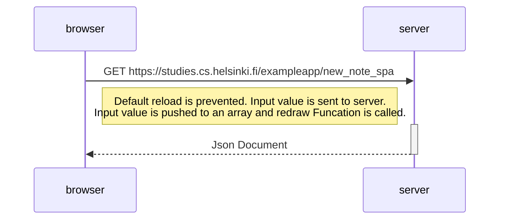

# Note using the single-page version of the app.

```mermaid
sequenceDiagram
    participant browser
    participant server

    browser->>server: GET https://studies.cs.helsinki.fi/exampleapp/new_note_spa
    note left of server: Default reload is prevented. Input value is sent to server. <br/> Input value is pushed to an array and redraw Funcation is called.
    activate server
    server-->>browser: Json Document
    deactivate server
```
